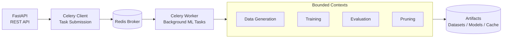

# Credit Risk ML Service


An MLOps service for credit risk modeling built with FastAPI and scikit-learn. This project demonstrates a Domain-Driven Design approach to structuring ML pipelines, where each stage operates as an independent bounded context.

ML pipelines are inherently multi-stage and multi-responsibility. A bounded-context architecture prevents cross-layer coupling and creates stable interfaces between stages.

## What This Project Demonstrates

The system includes the following components and architectural features:

- Clean domain-driven modular architecture (bounded contexts)
- Async distributed task processing (Celery + Redis)
- Background ML workloads (training, evaluation, pruning)
- PostgreSQL-backed artifact lineage (datasets, models, evaluations)
- Containerized multi-service stack (FastAPI + Celery worker + Redis + Postgres)
- CI-based automation using GitHub Actions (tests, dependency resolution)
- Full test suite with mocking (Celery tasks, workflow isolation)
- Resilient workflow orchestration with structured logging
- Proper project documentation (API docs, architecture, artifacts, testing)


## Architecture

This project follows **Domain-Driven Design (DDD)** principles with bounded contexts for each ML pipeline stage (data, train, evaluate, prune). Each domain owns its core logic, service orchestration, API routes, and schemas.



See [Architecture Diagram](docs/ARCHITECTURE.md) for detailed component flows and artifact management.


## Async Processing Model

Training, evaluation, and pruning are executed asynchronously:

- `POST /train` -> submits Celery task  
- `POST /evaluate` -> submits Celery task  
- `POST /prune` -> submits Celery task  

Each endpoint returns a `task_id`, and progress can be polled via:

- `/train/status/{task_id}`
- `/evaluate/status/{task_id}`
- `/prune/status/{task_id}`

This enables non-blocking ML operations suitable for production workloads.


## Quick Start

### Full Stack (Docker)

Run the full stack (API + worker + Redis + Postgres)

```bash
docker compose up --build
```

### Prerequisites

- Python 3.13+
- [uv](https://github.com/astral-sh/uv) package manager
- FRED API key (optional, for macroeconomic data)

### Installation

1. Clone the repository:
```bash
git clone https://github.com/Etirf/pub-credit-risk-fred-stlouis
cd pub-credit-risk-fred-stlouis
```

2. Install dependencies:
```bash
uv sync
```

3. Set up environment variables:
```bash
cp .env.example .env
# Add FRED_API_KEY to .env
```

4. Run the application:
```bash
uv run uvicorn app.main:app --reload
```

Note:
Running uvicorn this way launches only the API.
Background tasks (training / evaluation / pruning) require Redis + Celery worker + PostgreSQL.
Use `docker compose up --build` to run the full production stack.

API available at `http://localhost:8000`

## Testing

### Unit Tests

```bash
uv run pytest
```

Includes unit and integration tests (service and route layers). Tests use mocking and don't require Redis or PostgreSQL.

### Manual Testing

See [TESTING.md](docs/TESTING.md) for detailed testing instructions including:
- Docker Compose setup (PostgreSQL + Redis)
- Manual endpoint testing with curl
- Interactive API docs at `http://localhost:8000/docs`

## Features

- Domain-driven architecture with bounded contexts
- End-to-end ML pipeline: synthetic data generation -> training -> evaluation -> pruning
- **Async ML operations** via Celery (training, evaluation, pruning run as background tasks)
- PostgreSQL database for artifact metadata tracking
- Redis + Celery for distributed task processing
- Macroeconomic data integration via FRED API with fallback caching
- Artifact persistence with name-based workflow
- Unit and integration tests (service and route layers)
- Structured logging and error handling
- RESTful API with FastAPI

## Documentation

- [Architecture](docs/ARCHITECTURE.md) - DDD design, component flows, artifact management
- [API Documentation](docs/API.md) - Endpoint details, request/response schemas, error handling
- [Dataset Generation](docs/DATASET_GENERATION.md) - Synthetic data generation, schema, macro data, known implementation issues
- [Artifact Management](docs/ARTIFACTS.md) - Naming conventions, storage, reproducibility
- [Roadmap & Known Limitations](docs/ROADMAP.md)
- [Troubleshooting](docs/TROUBLESHOOTING.md)

**Note:** This is a demonstration project. See [Dataset Generation](docs/DATASET_GENERATION.md) for known implementation issues (macro data scaling, default rate threshold).

## Security

This project is not hardened for production use. No authentication, authorization, or input validation beyond Pydantic schemas is implemented. Do not expose to untrusted networks.

## License

MIT
