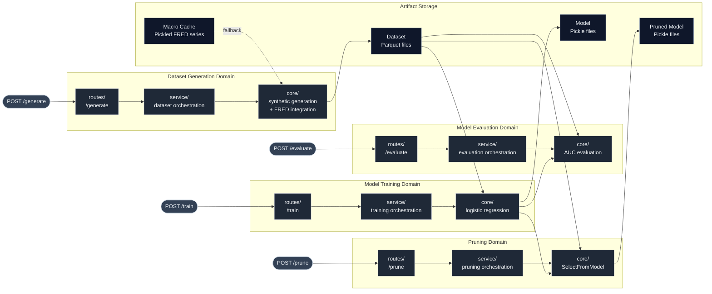

# Architecture

This project follows **Domain-Driven Design (DDD)** principles with bounded contexts for each ML pipeline stage:

```
app/
├── data/          # Dataset generation domain
├── train/         # Model training domain
├── evaluate/      # Model evaluation domain
└── prune/         # Feature pruning domain
```

Each domain contains:
- **`core/`** - Core business logic (pure functions, no dependencies)
- **`service/`** - Orchestration layer (workflow coordination, logging)
- **`routes/`** - HTTP endpoints (FastAPI routes)
- **`schemas/`** - Request/response models (Pydantic)

## Architecture Diagram



## Architecture Principles

Each bounded context produces named artifacts that subsequent contexts consume, enabling loose coupling. API endpoints use action-based routing (`/generate`, `/train`, `/evaluate`, `/prune`) for HTTP simplicity, while internal architecture follows DDD domain boundaries.

### Artifact Flow

- **Datasets** are generated and persisted with UUID-based names (`dataset_{uuid}.parquet`)
- **Models** are trained and persisted with timestamp-based names (`model_{timestamp}.pkl`)
- **Pruned models** derive their names from base models for traceability
- Artifacts are referenced by name across domain boundaries, avoiding direct data coupling

### Storage Layout

```
storage/
├── datasets/      # Persisted datasets (Parquet)
├── models/        # Persisted models (Pickle)
└── macro_cache/   # Cached FRED series (Pickle)
```

### Macro Cache Fallback

The macro cache (dashed line in diagram) is used only when FRED API is unavailable. Normal flow fetches from FRED API and updates cache; exceptions trigger cache fallback.

